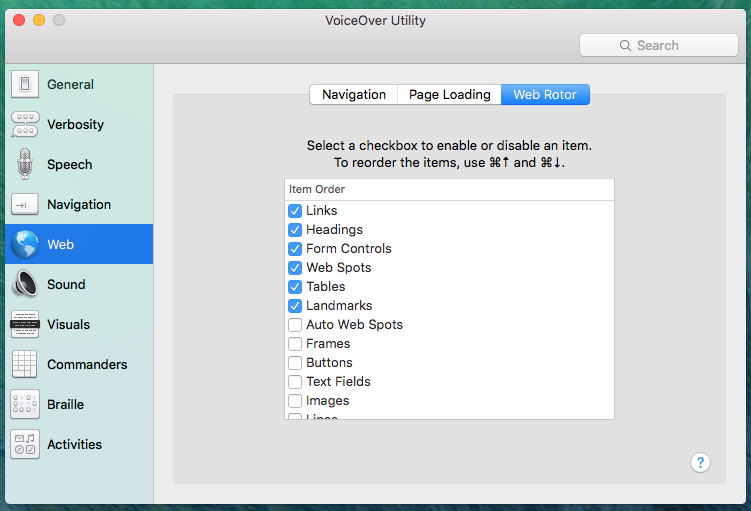

# A11Y-First : An Accessibility Workshop

The idea of this project it to run a live-coding session starting with an empty HTML file. From that starting point we will progressively build up a working page, and introduce many common accessibility principles and techniques along the way.

The following sections of this README act as a guide to the live-coding session instructor.

## Part 1

Part 1 is primarily concerned with static text, page structure and mental model.

### Meta Data

The meta.html page content is left intentionally blank.

1. Add `<html lang="en">`
1. Add `<meta charset="utf-8" />` to head
1. Add `<meta name="viewport" content="width=device-width, initial-scale=1">` to head
1. Test page with screen reader, notice nothing is announced
1. Add `<title>Meta - A11Y First Workshop</title>` to head
1. Test page with screen reader, notice title is now announces

#### Notes

We have introduced 4 key pieces of 'meta' data:

* Language attribute
    * Language attribute ensures correct pronunciation, amongst other things. See <a href="https://www.w3.org/TR/2008/REC-WCAG20-20081211/#meaning-doc-lang-id">WCAG 3.1.1</a>
* Charset
    * Not strictly WCAG related (or maybe it is?), but to display an HTML page correctly, a web browser must know which character set (character encoding) to use.
* Viewport Scale
    * Viewport meta must ensure pinch-to-zoom is **not** disabled. See <a href="https://www.w3.org/TR/2008/REC-WCAG20-20081211/#visual-audio-contrast-scale">WCAG 1.4.4</a> and <a href="https://ebay.gitbooks.io/mindpatterns/content/antipatterns/disabling_pinch-to-zoom.html">MIND Anti-Pattern: Disabling Pinch-to-Zoom</a>.
    * Valid use cases for disabling pinch to zoom are mapping applications and video games
* Title
    * Title ensures the user can orient themselves. See <a href="https://www.w3.org/TR/2008/REC-WCAG20-20081211/#navigation-mechanisms-title">WCAG 2.4.2</a>. Titles identify the current location without requiring users to read or interpret page content.

### Paragraphs

1. Add three paragraphs of content to the page:
    * `<p>eBay is where the world goes to shop, sell, and give. Our mission is to be the world’s favorite destination for discovering great value and unique selection.</p>`
    * `<p>For over 20 years, we've been working to create more economic opportunity for everyone. And we're just getting started.</p>`
    * `<p>Copyright © 1995-2016 eBay Inc. All Rights Reserved.</p>`
1. Ensure Voiceover web rotor settings include 'Static Text'.
1. Open Voiceover rotor and explore what it can find on the page (hint: nothing much yet! only the static paragraph text).

#### Web Rotor Settings



### Lists

1. Add two lists to the page (see markup below)
1. Ensure Voiceover web rotor settings include 'Lists'.
1. Explore lists with the screen reader.

#### HTML

```html
<ul>
    <li>Mix It Up</li>
    <li>At the Hearth</li>
    <li>Give Thanks</li>
    <li>Guests of Honour</li>
</ul>

<ul>
    <li>Christmas Socks</li>
    <li>MacBook Air</li>
    <li>Xbox One 500GB</li>
    <li>Playstation Pro 1TB</li>
</ul>
```

### Headings

1. Add headings to page:
    * `<h1>eBay</h1>`
    * `<h2>Collections</h2>`
    * `<h2>Daily Deals</h2>`
    * `<h2>Legal</h2>`
1. Use screen reader shortcut to navigate through headings.
1. Show list of headings in web rotor.
1. Add `clipped` class to the 'Legal' header
1. Add `<link rel="stylesheet" href="https://ir.ebaystatic.com/cr/v/c1/skin/v2.6.2/css/utility.min.css"/>`
1. Demo that legal header is now invisible
1. Demo the legal header is still conveyed to screen reader

### Landmarks

1. Add the following landmarks:
    * `<header role="banner">` around h1
    * `<main role="main">` around lists
    * `<footer role="contentinfo">` around legal content
1. Notice there is no *visual* difference to the page. This is intentional.
1. Display landmarks in screen reader landmarks lists
1. Navigate through landmarks using screen reader shortcuts

### Images

1. Add following image to banner `<h1></h1>` (lack of alt text intentional for now)
1. Demonstrate behaviour of missing alt text in screen reader
1. Add `alt="ebay"` to h1 content image
1. Demonstrate behaviour of alt text with screen reader
1. Add collection image before each collection title, alt="collection title"
1. Add daily deal image before each deal title, alt="deal title"
1. Use spacebar, up arrow, down arrow, page up, page down, home and end keys to scroll page

#### Notes

Note that the image alt text is the same as the title. Technically speaking these images can be classed as presentational, because if the images were not displayed, we still have the same text below (the title text). We leave the alt text in place for now. Yes, it's a redundant/duplicate navigation for screen reader users, but not technically 'non-accessible'. When we convert the item to a tile, in an upcoming step, we will set this value to blank.

### Grid

Demonstrates that in some cases, CSS can effect semantics.

1. Add `<link rel="stylesheet" href="https://ir.ebaystatic.com/cr/v/c1/skin/v2.6.2/css/grid-core.min.css"/>`
1. Wrap each collection item in a `class="grid__cell grid__cell--one-half"`
1. Add `role=list` to the lists to restore list semantics
1. Add `display: block` to images (see CSS below)
1. Add class `card` to daily deals div (see CSS below)

#### Notes

Adding `list-type: none` (via grids css) to the lists means they are <a href="http://www.456bereastreet.com/archive/201109/screen_readers_list_items_and_list-stylenone/">no longer announced as a list in some screen readers</a>. We fix this issue by applying `role=list` to each list.

#### CSS

```css
.collections img,
.deals img {
    display: block;
    max-width: 100%;
}
```

## Part 2

Part moves onto links and keyboard focus.

### Links

1. Add links around collection and daily deals titles
1. With screen reader disabled, use TAB key to navigate focus through links
1. Demo different focus outline in Firefox
1. Notice that hand cursor shows for links
1. Notice that with focus on a link all of the page scroll keys still work.
1. With screen reader on notice that visited links will be announce as 'visited'.
1. Add the seller profile static text under each collection
1. Add price under each daily deal title.
1. This new static text introduces one extra virtual cursor navigation for screen reader users.
1. Notice that it would be nice to have the image as a link to the item page too.

#### Discussion

* Should the title be a heading? I would say it is not strictly necessary, but opinion would be divided here.

### Cards

A purely presentation step where we convert each collection item into a card.

1. Add `<link rel="stylesheet" href="https://ir.ebaystatic.com/cr/v/c1/skin/v2.6.2/css/card.min.css"/>`
1. Wrap each collection item with `<div class="card"><div class="card__cell">...</div></div>`

### Tiles

We want the collection and deals images to link to the item too.

Rather than create a second link, which would be redundant for keyboard and screen reader users, we can wrap the title and image together in a single anchor.

#### Steps

1. Remove anchor tag from collection and deals titles and wrap them around the entire contents of list item
1. Show keyboard focus indicator
1. Set `display: inline-block` on anchor to fix focus-indicator.
1. Show fixed focus indicator
1. Listen to anchor in screen reader and notice that link text is red twice
1. Set the image alt value to blank
1. Listen to anchor in screen reader and now link text is only read once

#### Notes

* Anchor tags are inline-level elements in CSS by default. This causes some issues with the focus outline.
* What happens if we want to make the seller profile a link too?    
    * A: It can no longer be a tile.

#### CSS

```css
.tile {
    display: inline-block;
}
```

### Navigation Landmark

This is an opportunity to recap, and build upon, headings, landmarks and links.

1. Add `<nav role="navigation">` after banner tag
1. Add `<h2 class="clipped" id="main-nav">Main Categories</h2>`
1. Add list of links (see HTML below) after heading
1. Demo new navigation landmark in screen reader.
1. Add `aria-labelledby="main-nav"` to nav tag
1. Demo labelled navigation landmark in screen reader

#### HTML

```html
<nav role="navigation">
    <h2 class="clipped">Main Navigation</h2>
    <ul>
        <li><a href="http://www.ebay.com/motors">Motors</a></li>
        <li><a href="http://www.ebay.com/motors">Fashion</a></li>
        <li><a href="http://www.ebay.com/motors">Electronics</a></li>
        <li><a href="http://www.ebay.com/motors">Collectibles &amp; Art</a></li>
        <li><a href="http://www.ebay.com/motors">Home &amp; Garden</a></li>
        <li><a href="http://www.ebay.com/motors">Sporting Goods</a></li>
        <li><a href="http://www.ebay.com/motors">Toys</a></li>
        <li><a href="http://www.ebay.com/motors">Business &amp; Industrial</a></li>
        <li><a href="http://www.ebay.com/motors">Music</a></li>
        <li><a href="http://www.ebay.com/motors">Holiday</a></li>
    </ul>
</nav>
```

#### CSS

```css
[role=navigation] ul {
    border-bottom: 1px solid #ccc;
    border-top: 1px solid #ccc;
    display: flex;
    list-style-type: none;
    margin: 0;
    padding: 1em 0;
}
[role=navigation] li {
    text-align: center;
    width: 128px;
}
[role=navigation] a {
    font-size: 12px;
}
```

### Skipto Links

1. Add `<span class="skipto"><a href="#mainContent">Skip to main content</a></a>`
1. Add `id="mainContent"` to main landmark
1. Demo keyboard behaviour
1. Demo how screen reader focus does not get set
1. Add `tabindex="-1"` to main landmark
1. Demo how screen reader focus is now set
1. Demo that permanent tabindex on main element causes a focus outline when clicked with mouse or touch.
1. Add `<script src="app.js"></script>` after body tag
1. Call skip-to plugin `$('.skipto').skipTo();`
1. Add class `clipped clipped--stealth` to skip link
1. Demo that skip link now only appears on keyboard focus

#### HTML

```html
<span class="skipto">
    <a href="#mainContent" class="clipped clipped--stealth">Skip to main content</a>
</span>
```

#### CSS

```css
.clipped--stealth:focus {
    -webkit-clip-path: unset;
    clip: unset;
    clip-path: auto;
    height: auto;
    width: auto;
    z-index: 1;
}

a[href='#mainContent'] {
    background-color: LightYellow;
    left: 0;
    padding: 0.25em;
    top: 0;
}
```

```js
$('.skipto').skipTo();
```

#### Notes

* Rather than adding permanent tabindex to main, it would be better to set a temporary tabindex using javascript. The tabindex can be set when the skipto link is clicked (we already know the target id), and the tabindex cn be removed as soon as the target loses focus.

### Iframes

1. Add iframe between header and main (without a title attribute for now)
1. Demo that iframe is keyboard focusable in Firefox
1. Add image link to iframe_content.html
1. Demonstrate iframe taborder with keyboard
1. Demonstrate focus indicator issue with iframe content (iframes usually have body margin set to 0 which causes problem)
1. Demonstrate untitled iframe with screen reader
1. Add `title="Advert"` to iframe and demo with screen reader
    * This is the only recommended use of `title` attribute! (i.e. do not use it as a 'tooltip' on links)

#### HTML

```html
`<iframe src="iframe_content.html" scrolling="no"></iframe>`
```

```html
<a href="http://www.ebay.com/rpp/holidays/?&_trkparms=%26clkid%3D368520364132448429" target="_parent">
    
</a>
```

### Complementary landmark

1. Wrap iframe in `<aside role="Complementary">`

### Part 3

### Textbox

1. Add form tag to banner
1. Add textbox to form
1. Demo that textbox is focusable by default
1. Demo how arrow key behaviour on textbox is different than on link.
1. Enter search term and press ENTER. ENTER key should always submit form (even with no submit button).
1. Add placeholder text of 'search' to textbox
1. Demo placeholder with screen reader
1. Add label to textbox. Change placeholder text to ('iPhone 7')
1. Demo textbox and label
1. Replace label tag with an aria-label attribute on input
1. Demo textbox and aria-label
1. Talk about arrow key behaviour and 'forms mode' of screen reader.
1. Screen reader announces control value, label, type
1. Add `autofocus` attribute to textbox
1. Add Skin CSS `<link rel="stylesheet" href="https://ir.ebaystatic.com/cr/v/c1/skin/v2.6.2/css/textbox.min.css"/>`
1. Wrap textbox with skin markup `<span class="textbox textbox--small">..</span>`

### Listbox

Do not call a listbox a 'dropdown'! The term 'dropdown' is too ambiguous. The term 'dropdown' only describes the visual appearance of the control, and could be confused with a menu or any other kind of overlay. Use the correct term which describes the actual *purpose* of the control, which is listbox (or select). The purpose of a listbox (or select) is to select a value that will be sent to the server via form submit.

1. Add listbox and aria-label after textbox
1. ENTER key does not submit form.
1. SPACE or ARROW key expands.
1. ARROW keys highlight options, ENTER or SPACE selects.
1. Screen reader announces control value, label, type
1. Add Skin CSS:
    * `<link rel="stylesheet" href="https://ir.ebaystatic.com/cr/v/c1/skin/v2.6.2/css/iconfont.min.css"/>`
    * `<link rel="stylesheet" href="https://ir.ebaystatic.com/cr/v/c1/skin/v2.6.2/css/listbox.min.css"/>`
1. Wrap listbox with skin markup `<span class="listbox listbox--small listbox--no-label" id="gh-cat-listbox">..</span>`

### Submit Button

1. Add `<input type="submit" value="Search" />` after listbox
1. Notice that mouse hand cursor does not show for buttons.
1. Screen reader announces button value/label and type
1. Demo SPACEBAR and ENTER key behaviour
1. Add `action="search_results.html"` to form
1. Demo that form submits an HTTP GET request by default. A submit button is the only button that should navigate to a new URL in this way.
1. Demo that keyboard navigation starts from top of new page
1. Add reset button after submit button and demo it's behaviour
1. Remove submit button (we don't need it)
1. Add Skin CSS `<link rel="stylesheet" href="https://ir.ebaystatic.com/cr/v/c1/skin/v2.6.2/css/button.min.css"/>`
1. Add skin classes to button `class="btn btn--small btn--primary"`

### Search Landmark

1. Add `role=search` to form
1. Demo new search landmark in screen reader
1. Add class="grid__group" to header

## Part 4

Now we start looking at buttons that open different types of overlays.

These instructions are going to get a little harder to follow now.

### Click Flyout

1. Add Normalize.css `<link rel="stylesheet" href="https://ir.ebaystatic.com/cr/v/c1/skin/v2.6.2/css/normalize.min.css"/>`
1. Add Skin font.css `<link rel="stylesheet" href="https://ir.ebaystatic.com/cr/v/c1/skin/v2.6.2/css/icon.min.css"/>`
1. Add eyebrow div after skipto link
    * `<div id="eyebrow"><div class="grid">...</div></div>`
1. todo

#### HTML

```html
<div id="eyebrow">
    <div class="grid">
        <span id="profile" class="flyout flyout--click">
            <button class="flyout__trigger" type="button">Hi Ian</button>
            <div class="flyout__overlay">
                <ul role="list">
                    <li><a href="http://www.ebay.com">My Collections</a></li>
                    <li><a href="http://www.ebay.com">Account Settings</a></li>
                    <li><a href="http://www.ebay.com">Sign Out</a></li>
                </ul>
            </div>
        </span>
    </div>
</div>
```

#### CSS

```css
.flyout {
    position: relative;
}
.flyout__overlay {
    background-color: LightYellow;
    display: none;
    padding: 1rem;
    position: absolute;
    white-space: nowrap;
    z-index: 1;
}
.flyout--click .flyout__trigger span::before {
    font-size: x-small;
}
.flyout--click flyout__trigger[aria-expanded=true] + .flyout__overlay {
    display: block;
}
```

#### JS

```js
$('.flyout--click').clickFlyout({focusManagement:'first'});
```

### Non-Critical Icon

1. Append icon span to button `<span class="icon-arrow-down"/>`

### Hover Flyouts

We show the problem of opening a flyout on hover on a link.

1. Add a my ebay link to eyebrow
1. Convert it to a hover flyout using jquery-hover-flyout
1. Demonstrate keyboard issue
1. Convert it to a focus flyout using jquery-focus-flyout
1. Demonstrate that keyboard user now has to tab through flyout.
1. Remove focus flyout behaviour
1. Add a hidden jquery-click-flyout that allows keyboard user to expand the flyout with ENTER or SPACE.

#### HTML

```html
<span id="myebay" class="flyout flyout--hover">
    <a class="flyout__trigger" href="http://www.ebay.com">My eBay</a>
    <span class="flyout flyout--click">
        <button class="flyout__trigger clipped clipped--stealth" type="button">Expand My eBay</button>
        <div class="flyout__overlay">
            <ul role="list">
                <li><a href="http://www.ebay.com">Summary</a></li>
                <li><a href="http://www.ebay.com">Bids/Offers</a></li>
                <li><a href="http://www.ebay.com">Watchlist</a></li>
            </ul>
        </div>
    </span>
</span>
```

### CSS

```css
.flyout--hover .flyout__trigger[aria-expanded=true] + .flyout .flyout__overlay {
    display: block;
}

.flyout--hover .flyout--click {
    position: static;
}

.flyout--hover .flyout--click .flyout__trigger {
    background-color: #fff;
    border: 1px solid #ddd;
    border-radius: 3px;
    display: block;
    padding: 0.1em;
}
```

### JS

```js
$('.flyout--hover').hoverFlyout();
```

### Critical Icon

1. Append link to eyebrow `<a class="icon-cart" href="http://cart.payments.ebay.com" id="cart" aria-label="cart"></a>`
1. Remember that hand cursor shows for links

#### CSS

```css
#cart::before {
    font-weight: 900;
}
```

### Access Key

1. Add attribute `accesskey="c"` to shopping cart link
1. Use CTRL+OPTION+C to activate shortcut
1. Voiceover will announce availability of access key
1. But how do keyboard users know about this accesskey...

### Tooltip

1. Wrap shopping cart link in tooltip markup
1. Tooltips should be short.

```html
<span class="tooltip flyout">
    <a accesskey="c" aria-describedby="tooltip-cart" class="tooltip flyout__trigger icon-cart" href="http://cart.payments.ebay.com" id="cart" aria-label="cart"></a>
    <div class="flyout__overlay" id="tooltip-cart">Shopping Cart (Access Key: C)</div>
</span>
```

```css
.tooltip--expanded .flyout__overlay {
    background-color: LightYellow;
    display: block;
}
```

```js
$('.tooltip').hoverFlyout({expandedClass:'tooltip--expanded'}).focusFlyout({expandedClass:'tooltip--expanded'});
```

### Faux Button

1. Add `class="btn"` to the two see all links
1. Demo that screen reader still reads them as links (which is correct)
1. Explain that this can cause issues for customer service (non-sighted user reports UI control as a link, while sighted customer service person sees a button)
1. The giveaway for mouse users is the hand cursor icon.
1. The giveaway for keyboard users is the underline on focus.

### Live Region

1. Duplicate the `search-results.html` page as `search-results-ajax.html`
1. Add class `searchform` to form
1. Wrap the `10 results found` paragraph in a div
1. Add `<script src="app.js"></script>` below body
1. Update `main.js` to hijax form submission with client-side behaviour (see below)
1. Using screen reader demonstrate that page updates without notifying user
1. Add `aria-live="polite"` and `role="status"` to wrapper div
1. Using screen reader now demonstrate the screen reader can notify user of type of update (not the content that updated)

#### JavaScript

```js
$(function() {
    $('.searchform').on('submit', function(e) {
        e.preventDefault();
        $('.result-status').html('<p>0 results found</p>');
        $('main ul').empty();
    });
});
```

## Part 5

Next we move onto controls that cannot be created with HTML alone. These controls require ARIA, CSS and JavaScript.

### Tabs

### Comboboxes

We add combobox behaviour to search textbox.

### Menus

Do not call a menu a 'dropdown'! The term 'dropdown' is too ambiguous. The term 'dropdown' only describes the visual appearance of the control, and could be confused with a menu or any other kind of overlay. Use the correct term which describes the actual *purpose* of the control, which is menu (or popup menu). The purpose of a menu (or popup menu) is to select a value that will trigger some client-side event.

### Dialogs

Do not call a dialog an 'overlay'! The term 'overlay' is too ambiguous. The term 'overlay' only describes the visual appearance of the control, and could be confused with a tooltip or any other kind of overlay. Use the correct term which describes the actual *purpose* of the control, which is dialog (or modal). The purpose of a dialog (or modal) child window is to collect data to pass back to the parent window.

## Other

We will wrap up with some other concepts that were not applicable in the demo page.

### Tables
