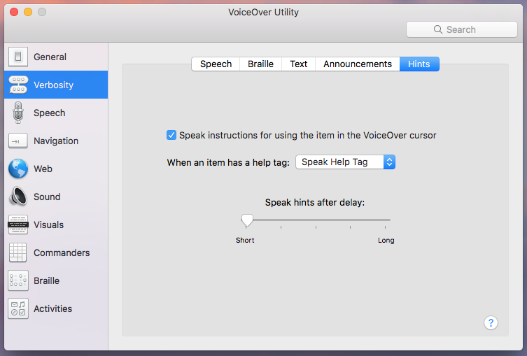

# a11y-first-workshop : A Web Accessibility Workshop

HTML is fully accessible by default, but whenever a developer chooses the wrong tag, wrong ARIA attribute, or adds a line of CSS or JavaScript, they run the risk of breaking that out-of-the-box accessibility.

Starting completely from scratch, this workshop will progressively build up the UI for a typical eCommerce homepage, sign-in page, and SRP, introducing many common accessibility principles, techniques and gotchas along the way.

No prior accessibility experience is necessary, but we assume some basic familiarity with HTML, CSS and JavaScript. If you get lost or lose your way, every step of every chapter has a "here's one I made earlier" that you can copy-and-paste from into your file.

* [Chapter 1: Introduces Structure &amp; Semantics](user-content-chapter-1-introduces-structure-semantics)
* [Chapter 2: Introduces Links](user-content-chapter-2-introduces-links)
* [Chapter 3: Introduces Form Controls](user-content-chapter-3-introduces-form-controls)
* [Chapter 4: Introduces Form Validation](user-content-chapter-4-introduces-form-validation)
* [Chapter 5: Introduces Buttons](user-content-chapter-5-introduces-buttons)
* [Chapter 6: Introduces ARIA Widgets](user-content-chapter-6-introduces-aria-widgets)
* [Chapter 7: Introduces Data Tables](user-content-chapter-7-introduces-data-tables)

## Chapter 1: Introduces Structure &amp; Semantics

Chapter 1 builds a mock version of a typical eCommerce homepage.

Whenever I build a new page or component, I always start with the markup. I don't even think about the CSS and JavaScript until I am happy with the structure and semantics. In fact, I will go as far as to disable CSS and JavaScript in my browser to ensure that the raw markup is accessible and functional.

Some developers, on the other hand, like to start with the JavaScript first. Or the "bells and whistles" as I like to say. To me this is like a builder placing down all of the household electronics (television, microwave, internet router, etc) on the plot of land before the foundations have been laid, walls built and windows put in. Yes, it's exactly like that. Okay, okay maybe I need a better analogy ;-)

1. [Blank Page](user-content-blank-page)
1. [Meta Data](user-content-meta-data)
1. [Paragraphs](user-content-paragraphs)
1. [Lists](user-content-lists)
1. [Headings](user-content-headings)
1. [Landmarks](user-content-landmarks)
1. [Images](user-content-images)
1. [Background Images](user-content-background-images)
1. [Table Layout](user-content-table-layout)
1. [Grid System](user-content-grid-system)
1. [Cards](user-content-cards)
1. [Inline Frames](user-content-inline-frames)

### Blank Page

We'll beging with our index page. The page content for this step is left intentionally blank.

```html
<!DOCTYPE html>
<html>
    <head>
        <link rel="stylesheet" href="https://ir.ebaystatic.com/cr/v/c1/skin/v7.0.2/ds4/skin.min.css"/>
        <link rel="stylesheet" href="https://ir.ebaystatic.com/cr/v/c1/skin/v6.3.3/ds4/grid-full.min.css"/>
        <link rel="stylesheet" href="app.css"/>
    </head>
    <body>
        <!-- intentionally blank -->
    </body>
    <!-- uncomment the following line when instructed -->
    <!-- <script src="app.js"></script>-->
</html>
```

1. Test page with screen reader, notice nothing is announced

### Meta Data

Let's begin adding some meta data to the page.

1. Add `lang="en"` to the `html` tag
1. Add `<meta charset="utf-8" />` to head
1. Add `<meta name="viewport" content="width=device-width, initial-scale=1">` to head
1. Add `<title>Meta - A11Y First Workshop</title>` to head
1. Test page with screen reader, notice title is now announced

We have introduced 3 key pieces of 'meta' data:

* Language attribute ensures correct pronunciation, amongst other things.
    * See <a href="https://www.w3.org/TR/2008/REC-WCAG20-20081211/#meaning-doc-lang-id">WCAG 3.1.1</a>
* Viewport meta must ensure pinch-to-zoom is **not** disabled.
    * See <a href="https://www.w3.org/TR/2008/REC-WCAG20-20081211/#visual-audio-contrast-scale">WCAG 1.4.4</a> and <a href="https://ebay.gitbooks.io/mindpatterns/content/antipatterns/disabling_pinch-to-zoom.html">MIND Anti-Pattern: Disabling Pinch-to-Zoom</a>.
    * Valid use cases for disabling pinch-to-zoom are mapping applications and video games
* Title ensures the user can orient themselves.
    * See <a href="https://www.w3.org/TR/2008/REC-WCAG20-20081211/#navigation-mechanisms-title">WCAG 2.4.2</a>. Titles identify the current location without requiring users to read or interpret page content.

### Paragraphs

1. Add three paragraphs of content to the page (HTML below)
1. Ensure VoiceOver web rotor settings include 'Static Text'.
1. Navigate VO to web area (show that voiceover can read desktop and other desktop applications too, not just web pages)
1. Open VoiceOover rotor and explore what it can find on the page (hint: nothing much yet! only the static paragraph text).
1. We ignore VO 'Web Spots' rotor as this is specific to Voiceover.


```html
`<p>eBay is where the world goes to shop, sell, and give. Our mission is to be the world’s favorite destination for discovering great value and unique selection.</p>`
`<p>For over 20 years, we've been working to create more economic opportunity for everyone. And we're just getting started.</p>`
`<p>Copyright © 1995-2017 eBay Inc. All Rights Reserved.</p>`
```

### Lists

1. Add two unordered lists to the page (see markup below)
1. Ensure VoiceOver web rotor settings include 'Lists'
1. Explore lists with VO shortcuts and web rotor
1. Demonstrate that VO stops on list element and announces number of items in each list
1. Demonstrate that VO announces 'bullet' before each list item contents

```html
<ul>
    <li>Mix It Up - 17 items by statesidelife</li>
    <li>At the Hearth - 9 items by designassembly</li>
    <li>Give Thanks - 35 items by ebayhomeeditor</li>
    <li>Guests of Honour - 30 items by ebaydealseditor</li>
</ul>

<ul>
    <li>Christmas Socks - $4.99</li>
    <li>MacBook Air - $799.99</li>
    <li>Xbox One 500GB - $169.99</li>
    <li>Playstation Pro 1TB - $419.99</li>
</ul>
```

#### Discussion!

What's the difference between an unordered list and an ordered list?

### Headings

1. Add the following headings:
    * `<h1>eBay</h1>`
    * `<h2>Collections</h2>`
    * `<h2>Daily Deals</h2>`
    * `<h2>Legal</h2>`
1. Navigate headings with voiceover keyboard shortcuts and web rotor

It's a bit odd to display a "Legal" header. It's probably not going to fly with designers, but SEO and screenreader users need it. Let's address that now.

1. Add `clipped` class to the 'Legal' header
1. Demo that legal header is now 'invisible'
1. Demo the legal header is still conveyed to screen reader
1. Show legal header in screen reader headings list

```css
.clipped {
    border: 0;
    clip: rect(1px, 1px, 1px, 1px);
    -webkit-clip-path: inset(50%);
          clip-path: inset(50%);
    height: 1px;
    overflow: hidden;
    padding: 0;
    position: absolute;
    white-space: nowrap;
    width: 1px;
}
```

### Landmarks

1. Add the following landmark tags:
    * `<header>` around h1
    * `<main>` around lists
    * `<footer>` around legal content
1. Notice there is no *visual* difference to the page. This is intentional.
1. Display landmarks in screen reader landmarks lists. Notice that footer is not visible
1. Add the following landmark roles
    * `role="banner"` to header
    * `role="main"` to main
    * `role="contentinfo"` to footer
1. Display landmarks in screen reader landmarks lists. Notice that footer is now visible as contentinfo

```css
footer[role="contentinfo"] {
    background-color: white;
    border-top: 1px solid #ccc;
    margin-top: 32px;
    padding-bottom: 8px;
}
```

### Images

1. Replace `<header role="banner"><h1>eBay</h1></header>` with `<div><h1></h1></div>` (lack of alt text intentional for now)
1. Demonstrate behaviour of missing alt text in screen reader (it reads image url/filename)
1. Add `alt="ebay"` to h1 content image
1. Demonstrate behaviour of alt text with screen reader (it now reads 'ebay' text)
1. Add image before each collection and deal title, and for the time being set alt="collection/deal title" (we will set this to blank in a later section)
1. Wrap title in paragraph tag
1. Demonstrate that voiceover no longer announces 'bullet' for each list item

```html
<div class="collections">
    <ul>
        <li>
            
            <p>Mix It Up - 17 items by statesidelife</p>
        </li>
        <li>
            
            <p>At the Hearth - 9 items by designassembly</p>
        </li>
        <li>
            
            <p>Give Thanks - 35 items by ebayhomeeditor</p>
        </li></a>
        <li>
            
            <p>Guests of Honour - 30 items by ebaydealseditor</p>
        </li>
    </ul>
</div>
```

Now that we have content that goes below the fold, we can demonstrate some keyboard accessibility.

1. Use spacebar, up arrow, down arrow, page up, page down, home and end keys to scroll page

#### DISCUSSION!

Note that the image alt text is the same as the title. Technically speaking these images can be classed as presentational, because if the images were not displayed, we still have the same text below (the title text). We leave the alt text in place for now. Yes, it's a redundant/duplicate navigation for screen reader users, but not technically 'non-accessible'. When we convert the item to a tile, in an upcoming step, we will set this value to blank.

### Background Images

Now let's try adding images in a different way, using CSS background images.

```html
<h2>Daily Deals</h2>
<div>
    <ul>
        <li>
            <span class="image" role="img" style="background-image: url('images/christmas-socks.jpg')" aria-label="Christmas Socks"></span>
            <p>Christmas Socks - $4.99</p>
        </li>
        <li>
            <span class="image" role="img" style="background-image: url('images/macbook-air.jpg')" aria-label="MacBook Air"></span>
            <p>MacBook Air - $799.99</p>
        </li>
        <li>
            <span class="image" role="img" style="background-image: url('images/xbox-one.jpg')" aria-label="Xbox One 500GB"></span>
            <p>Xbox One 500GB - $169.99</p>
        </li>
        <li>
            <span class="image" role="img" style="background-image: url('images/playstation-pro.jpg')" aria-label="Playstation 4 Pro"></span>
            <p>Playstation 4 Pro - $419.99</p>
        </li>
    </ul>
</div>
```

1. Disable images in Firefox browser and point out that foreground images show alt text, background images do not

#### DISCUSSION

How do we decide between using foreground images and background images. Imagine a Google or Bing image search that returned no images when CSS is disabled, or no alternative text for images. With foreground images we can avoid that situation. Important images should never require CSS or JavaScript!

### Table Layout

Demonstrate the problems with using table tags for layout.

1. Replace the list of collections with a 4x4 table
1. Replace the list of deals with a 1x4 table
1. Demonstrate that screen reader announces rows & columns (voiceover also needs tbody and empty th to demo this)
1. Add role="presentation" to the two tables
1. Demonstrate that screen reader now no longer announces table dimensions

### Grid System

Demonstrate that in some cases, CSS can effect semantics.

1. Revert the table changes made in the previous step (i.e. back to a list)
1. Add div wrapper container inside of body (presentational step, see CSS below)
1. Add div wrapper container inside of footer (presentational step, see CSS below)
1. Add class `.grid` to the `.collections` and `.deals`
1. Add `grid__group grid__group--no-gutters grid__group--wrap` to the collections list
1. Add `grid__group grid__group--no-gutters` to the deals list
1. Wrap each collection list item in a `class="grid__cell grid__cell--one-half"`
1. Demonstrate that voiceover no longer announces list semantics
1. Add `role="list"` to the lists to restore list semantics
1. Add `display: block` and `max-width: 100%` to images (see CSS below) so they scale responsively (not strictly needed for a11y purposes).

Adding `list-type: none` (via grids css) to the lists means they are <a href="http://www.456bereastreet.com/archive/201109/screen_readers_list_items_and_list-stylenone/">no longer announced as a list in some screen readers</a>. We fix this issue by applying `role="list"` to each list.

```css
body > div,
footer[role="contentinfo"] > div {
    margin: 0 auto;
    max-width: 1280px;
}

.collections img,
.deals img {
    display: block;
    max-width: 100%;
}
```

### Cards

A purely presentation step where we convert each collection item into a card using Skin CSS.

1. Wrap each collection item with `<div class="card"><div class="card__cell">...</div></div>`

### Inline Frames

Create a new `iframe-content-1.html` page with the following markup:

```html
<!DOCTYPE html>
<html lang="en">
    <head>
        <meta charset="utf-8" />
        <meta name="viewport" content="width=device-width, initial-scale=1">
        <style>
            body {
                margin: 0;
            }
            img:last-child {
                position: absolute;
                top: 20px;
                left: 20px;
            }
        </style>
    </head>
    <body>
        
        
    </body>
</html>
```
Add the following CSS:

```css
iframe {
    border: 0;
    height: 200px;
    margin: 1rem 0;
    width: 100%;
}
```

1. Add iframe without title between header and main `<iframe src="iframe-content-1.html" scrolling="no"></iframe>`
1. Demo that iframe is keyboard focusable in Firefox
1. Demonstrate untitled iframe behaviour with screen reader
1. Add `title="Advert"` to iframe and demo with screen reader
1. This is the only recommended use of `title` attribute! (i.e. do not use it as a 'tooltip' on links)
1. Navigate inside iframe with screen reader
1. On main page, wrap iframe in `<aside role="complementary">`. Launch VoiceOver list of landmarks.

This is the final content of main page:

```html
<aside role="complementary">
  `<iframe src="iframe-content-1.html" scrolling="no" title="Advert"></iframe>`
 </aside>
```

## Chapter 2: Introduces Links

Chapter 2 continues to build upon our homepage, before moving onto a typical sign in page.

1. [Text Links](user-content-text-links)
1. [Tiles](user-content-tiles)
1. [Ambiguous Links](user-content-ambiguous-links)
1. [Fake Buttons](user-content-fake-buttons)
1. [New Window Link](user-content-new-window-link)
1. [Navigation Landmark](user-content-navigation-landmarks)
1. [Skip-to Link](user-content-skipto)
1. [Enhanced Skip-to](user-content-skipto-enhanced)
1. [Custom Focus](user-content-custom-focus)

### Text Links

1. Add links around collection and daily deals titles
1. Temporarily add `a {text-decoration: none}`
1. Demonstrate the challenges of finding hyperlinks within paragraph text
1. Remove `a {text-decoration: none}`
1. With screen reader disabled, use TAB key to navigate focus through links
1. Demo different focus outline in Firefox
1. Notice that hand cursor shows for links
1. Notice that with focus on a link all of the page scroll keys still work.
1. With screen reader on notice that visited links will be announce as 'visited'.
1. Notice that it would be nice to have the image as a link to the item page too. We will address this in a later step.

#### Discussion

* Should the link/title be a heading? I would say it is not strictly necessary for accessibility, but maybe so for SEO. Opinion is often divided here.

### Tiles

1. Move anchor tag from collection and deals titles and wrap it around the entire contents of list item
1. Show keyboard focus indicator
1. Set `display: block` on anchor to fix focus-indicator.
1. Show fixed focus indicator
1. Listen to anchor in screen reader and notice that link text is red twice
1. Set the image alt value to blank
1. Listen to anchor in screen reader and now link text is only read once
1. Demonstrate what happens if we try to make seller profile a nested link inside of the tile.
1. Notice that now all text in tile is blue. Can fix this with CSS.

```css
a.item-tile {
    display: block;
}
a.item-tile p:last-child {
    color: #555;
}
```

### Ambiguous Links

1. Add "See all" link after collections and deals lists
1. Align link to center of grid
1. Demonstrate that we now have two 'ambiguous' links with same text that go to different places
1. Append clipped text to each link text
1. Demonstrate the difference if using aria-label

```html
<div class="see-all">
    <a href="http://www.ebay.com/cln">See all<span class="clipped"> - Collections</span></a>
</div>
...
<div class="see-all">
    <a href="http://deals.ebay.com">See all<span class="clipped"> - Deals</span></a>
</div>
```

```css
.see-all {
    text-align: center;
}
.see-all a {
    text-decoration: none;
}
```

### Fake Buttons

1. Add `class="btn"` to the two "see all" links
1. Notice that skin hasn't styled them. Something is wrong. Skin enforces accessibility. We don't allow btn class on a link unless developer signifies they know what they are doing.
1. Add `class="fake-btn"`
1. Link is now styled as a button
1. Demo that screen reader still reads them as links (which is correct)
1. Explain that this can cause issues for customer service (non-sighted user reports UI control as a link, while sighted customer service person sees a button)
1. The giveaway for mouse users is the hand cursor icon.
1. The giveaway for keyboard users is the underline on focus.

### New Window Link

Append the following link to the legal footer paragraph:

```html
<a href="http://pages.ebay.com/help/policies/user-agreement.html" target="_blank">User Agreement</a>
```

Demonstrate that screen reader does not notify user of this behaviour when focus is on link.

Add clipped text:

```html
<a href="http://pages.ebay.com/help/policies/user-agreement.html" target="_blank">User Agreement<span class="clipped"> - opens in new window or tab</span></a></p>
```

This lets screen reader users know about link behaviour, but sighted users still do not know. Let's fix that with an icon:

```html
<a href="http://pages.ebay.com/help/policies/user-agreement.html" target="_blank">User Agreement <span class="icon icon--window" role="img" aria-label="Opens in new window or tab"></span></a>
```

The following CSS is needed for the icon:

```css
span.icon {
    background-repeat: no-repeat;
    background-size: contain;
    display: inline-block;
}

span.icon--window {
    background-image: url(data:image/svg+xml;base64,PHN2ZyB4bWxucz0iaHR0cDovL3d3dy53My5vcmcvMjAwMC9zdmciIHZpZXdCb3g9IjAgMCAyOCAyNSI+PHBhdGggZmlsbD0iIzc2NzY3NiIgZD0iTS40OTcgNS43MDFoMTUuNjQ0Yy4yNzQgMCAuNDk3LjIyMi40OTcuNDk3di43MThhLjQ5Ny40OTcgMCAwIDEtLjQ5Ny40OTdILjQ5N0EuNDk3LjQ5NyAwIDAgMSAwIDYuOTE2di0uNzE4YzAtLjI3NC4yMjItLjQ5Ny40OTctLjQ5N3ptMS4yMTUgMFYyMy45NEgwVjUuNzAxaDEuNzEyem0xOC41MTUgNy43ODV2OS45MzlhLjU1Mi41NTIgMCAwIDEtLjU1Mi41NTJoLS42OTlhLjU1Mi41NTIgMCAwIDEtLjU1Mi0uNTUydi05LjkzOWMwLS4zMDUuMjQ3LS41NTIuNTUyLS41NTJoLjY5OWMuMzA1IDAgLjU1Mi4yNDcuNTUyLjU1MnpNMCAyMi4zMDJoMjAuMjA5djEuNzEySDB2LTEuNzEyek0yNS43NjcuMTYxaDEuOTE0djE2LjU4M2gtMS45MTRWLjE2MXptMS45MTQtLjE0N3YxLjkxNEgxMS4wOThWLjAxNGgxNi41ODN6TTI2LjMyMiAwbDEuMzUzIDEuMzUzTDEzLjM5OCAxNS42M2wtMS4zNTMtMS4zNTNMMjYuMzIyIDB6Ii8+PC9zdmc+);
    height: 12px;
    vertical-align: top;
    width: 12px;
}
```

### Navigation Landmark

This is an opportunity to recap, and build upon, headings, landmarks and links.

1. Add list of links (see HTML below) after banner tag
1. Wrap links with `<nav id="cat-nav" role="navigation">`
1. Add `<h2 class="clipped" id="cat-nav">Categories</h2>`
1. Demo new navigation landmark in screen reader.
1. Add `aria-labelledby="main-nav"` to nav tag
1. Demo labelled navigation landmark in screen reader

```html
<nav aria-labelledby="cat-nav-title" id="cat-nav" role="navigation">
    <h2 class="clipped" id="cat-nav-title">Categories</h2>
    <ul role="list">
        <li><a href="http://www.ebay.com/motors">Motors</a></li>
        <li><a href="http://www.ebay.com/motors">Fashion</a></li>
        <li><a href="http://www.ebay.com/motors">Electronics</a></li>
        <li><a href="http://www.ebay.com/motors">Collectibles &amp; Art</a></li>
        <li><a href="http://www.ebay.com/motors">Home &amp; Garden</a></li>
        <li><a href="http://www.ebay.com/motors">Sporting Goods</a></li>
        <li><a href="http://www.ebay.com/motors">Toys</a></li>
        <li><a href="http://www.ebay.com/motors">Business &amp; Industrial</a></li>
        <li><a href="http://www.ebay.com/motors">Music</a></li>
        <li><a href="http://www.ebay.com/motors">Holiday</a></li>
    </ul>
</nav>
```

```css
#cat-nav [role=list] {
    border-bottom: 1px solid #ccc;
    border-top: 1px solid #ccc;
    display: flex;
    list-style-type: none;
    margin: 0;
    padding: 1em 0;
}
#cat-nav li {
    text-align: center;
    width: 128px;
}
#cat-nav a {
    font-size: 12px;
}
```

### Skip-To Link

1. Add `<span class="skipto"><a href="#mainContent">Skip to main content</a></a>`
1. Add `id="mainContent"` to main landmark
1. Demo keyboard behaviour
1. Add class `clipped clipped--stealth` to skip link
1. Demo that skip link now only appears on keyboard focus
1. Demo how screen reader focus does not get set
1. Add `tabindex="-1"` to main landmark
1. Demo how screen reader focus is now set
1. Demo that permanent tabindex on main element causes a focus outline when clicked with mouse or touch.
1. Fix focus outline issue with CSS. This is perhaps the only time it is okay to remove focus outline.

```html
<span class="skipto">
    <a href="#mainContent" class="clipped clipped--stealth">Skip to main content</a>
</span>
```

```css
.clipped--stealth:focus {
    -webkit-clip-path: unset;
    clip: unset;
    clip-path: auto;
    height: auto;
    width: auto;
    z-index: 1;
}

a[href='#mainContent'] {
    background-color: LightYellow;
    left: 0;
    padding: 0.25em;
    top: 0;
}

#mainContent:focus {
    outline: 0 none;
}
```

### CHECKPOINT: JavaScript

At this point we will be introducing some JavaScript. So please create a JavaScript file and include it on your page. The `jquery-skip-to` plugin is also required.

### Skip-To Link Enhanced

Rather than adding permanent tabindex to main, it would be better to set a temporary tabindex using javascript. The tabindex can be set when the skipto link is clicked (we already know the target id), and the tabindex can be removed as soon as the target loses focus.

```js
$('.skipto').skipTo();
```

### Custom Focus

Now we go back to our iframe content.

1. Wrap image in link and demonstrate focus indicator issue when iframe body has zero margin
1. Add a second image after the first ``
1. Move link around this new image
1. Create an advert that plenty of margin around hyperlink

This is the final content of the IFRAME:

```html
<!DOCTYPE html>
<html lang="en">
    <head>
        <meta charset="utf-8" />
        <meta name="viewport" content="width=device-width, initial-scale=1">
        <style>
            body {
                margin: 0;
            }
            a {
                position: absolute;
                top: 20px;
                left: 20px;
            }
        </style>
    </head>
    <body>
        
        <a href="http://www.ebay.com/rpp/holidays/?&_trkparms=%26clkid%3D368520364132448429" target="_parent">
            
        </a>
    </body>
</html>
```

### Custom Focus

We will use the image link inside of the iframe to demonstrate a custom focus indicator.

```css
a:focus {
    outline: 2px dashed white;
}
```

### CHECKPOINT: Sign In &amp; Registration

We now move onto two new pages, sign in and registration. Create two files `signin.html` and `reg.html`. Both pages have the following content to begin with:

```html
<body class="identity">
    <div role="main">
        <h1 class="clipped">Sign In and Registration</h1>
        <!-- content goes here -->
    </div>
</body>
```

Add the following styles to `app.css`:

```css
body.identity [role="main"] {
    background-color: white;
    border: 1px solid #ccc;
    margin: 16px auto;
    padding: 16px;
    width: 400px;
}
```

### Fake Tabs

Links are sometimes presented visually as tabs, but retain their link behaviour. It is a common mistake amongst developers to assign the ARIA tab related roles to these links.

Add the following list of links inside the main landmark:

```html
<div>
    <ul>
        <li>
            <a href="fake-tabs.html">Sign In</a>
        </li>
        <li>
            <a href="../reg/fake-tabs.html">Register</a>
        </li>
    </ul>
    <div>
        <p>Sign-in form goes here</p>
    </div>
</div>
```

Demonstrate that everything we have already learnt about lists and links applies here. We could also use a navigation landmark around the list.

Now add the following Skin classes to style the links as fake tabs:

```html
<div class="fake-tabs">
    <ul class="fake-tabs__items">
        <li class="fake-tabs__item fake-tabs__item--current">
            <a aria-current="page" href="#">Sign In</a>
        </li>
        <li class="fake-tabs__item">
            <a href="reg.html">Register</a>
        </li>
    </ul>
    <div class="fake-tabs__content">
        <form>
            <p>Sign-in form goes here</p>
        </form>
    </div>
</div>
```

Demonstrate that the tabs are still announced as links, and still show up in the screen reader list of links. This is the desired, expected behaviour.

The `aria-current` property announces which link in the list matches the current URL.

#### Discussion

A problem with fake-tabs is that they look *too* realstic. Keyboard users might try and use the arrow keys, rather than the TAB key.

## Chapter 3: Introduces Form Controls

Chapter 3 continues on with our sign in and registration pages.

1. [Textbox](user-content-textbox)
1. [Radio](user-content-radio)
1. [Customised Radio](user-content-customised-radio)
1. [Select](user-content-select)
1. [Customised Select](user-content-customised-select)
1. [Reset](user-content-reset)
1. [Submit](user-content-submit)
1. [Textbox Icon](user-content-textbox-icon)
1. [Checkbox](user-content-checkbox)
1. [Customised Checkbox](user-content-customised-checkbox)
1. [Field Description](user-content-field-description)

### Textbox

Add textbox and label for email inside of form.

```html
<label for="email">Email</label>
<input id="email" name="email" type="text" />
```

1. We call it `textbox` (after the ARIA role) or `text field`
1. Demo that textbox is focusable with TAB key
1. Demo how ARROW key behaviour on textbox is different than on link.
1. Talk about ARROW key behaviour and 'forms mode' of screen reader.
1. Demo that ENTER key does nothing... yet
1. Demo that screen reader announces value (or contents), label, type (edit text) and state (in no particular order)
1. The `name` attribute is used by the server (key/value pair). The `id` attribute is used by the label tag
1. Add `disabled` attribute to textbox and demonstrate screen reader behaviour (it now reads "dimmed")
1. Remove `disabled` attribute
1. Add `readonly` attribute to textbox and demonstrate screen reader behaviour (it now just says "text" instead of "edit text")
1. Remove `readonly` attribute
1. Add `autofocus` attribute to textbox and demonstrate behaviour on page load
1. Remove `autofocus` attribute
1. Add skin field related classes (`field`, `field__label field__label--stacked` and `field__control`)

Also add textbox &amp; label for password, first name, last name and phone, adding [Skin Textbox Classes](https://ebay.github.io/skin/#textbox). For example, final email field should look like this:

```html
<div class="field">
    <label class="field__label field__label--stacked" for="email">Email</label>
    <div class="field__control textbox">
        <input class="textbox__control textbox__control--fluid" id="email" name="email" type="text" />
    </div>
</div>
```

Add the following CSS for layout of the side-by-side fields:

```css
.field-group {
    display: flex;
    margin: 16px 0;
}

.field-group span.field {
    width: 100%;
}
```

### Radio

We are done with the sign in page, and now move back to our registration page.

Radio buttons are our first introduction to using the ARROW keys. The TAB key moves keyboard focus into the radio group, the ARROW keys interact with the radio group buttons. Pressing the TAB key again moves keyboard focus off the radio group onto the next interactive element on the page.

1. Add the HTML below to the fake tabs content panel
1. Demonstrate keyboard behaviour
    * TAB key does not move from radio to radio
    * ARROW key selects
1. Demonstrate screen reader semantics (type, label, state)

```html
<input id="paccount" name="account_type" type="radio" value="p" />
<label for="paccount">Personal account</label>
<input id="baccount" name="account_type" type="radio" value="b" />
<label for="baccount">Business account</label>
```

1. Add a fieldset and legend (clipped)
1. Demonstrate additional screen reader semantics (group name/label)
1. Notice that the number and index position of radio is announced, therefore we do not need to put radios inside of lists.

```html
<fieldset>
    <legend class="clipped">Account Type</legend>
    <input id="paccount" name="account_type" type="radio" value="p" />
    <label for="paccount">Personal account</label>
    <input id="baccount" name="account_type" type="radio" value="b" />
    <label for="baccount">Business account</label>
</fieldset>
```

Add margins for the fieldset:

```css
fieldset {
    margin: 16px 0;
}
```

### Customised Radio

Skin enhances the native radios with a custom SVG style, while maintaining the accessibility of the underlying form controls.

Anytime you need to ensure the user makes only single selection (e.g. [star rating](http://ianmcburnie.github.io/mindpatterns/input/starrating/)), radio buttons should be used, and their appearance can be customised using background or foreground SVG.

```html
<span class="radio">
    <input class="field__control radio__control" name="account_type" type="radio" value="p" />
    <span class="radio__icon"></span>
</span>
```

If you ever use `role="radio"` on a tag other than input, you must ensure that all keyboard and screen reader behaviour associated with native radios is met. And remember that only the input tag supports form data and browser autofill behaviour.

### Select

Add a native HTML form select with label:

```html
<div class="field">
    <label class="field__label field__label--stacked" for="dial-code">Dialing Code</label>
    <select id="dial-code" name="dc">
        <option value="1">United States +1</option>
        <option value="44">United Kingdom +44</option>
        <option value="1">Canada +1</option>
    </select>
</div>
```

1. SPACE or ARROW key expands.
1. ARROW keys highlight options, ENTER or SPACE selects.
1. Screen reader announces control value, label, type

### Customised Select

Skin provides a custom style for the select `button`, but not for the overlay.

```html
<div class="field">
    <label class="field__label field__label--stacked" for="dial-code">Dialing Code</label>
    <span class="field__control select">
        <select class="select__control select__control--fluid" id="dial-code" name="dc">
            <option value="1">United States +1</option>
            <option value="44">United Kingdom +44</option>
            <option value="1">Canada +1</option>
        </select>
        <span class="select__icon" />
    </span>
</div>
```

If you ever try and construct a fully custom select control (i.e. including the overlay), you must ensure that all keyboard and screen reader behaviour associated with a native select control is met.  And remember that only the select tag supports form data and browser autofill behaviour.

#### Reset

1. Add reset button after submit button and demo it's behaviour
1. Notice that a reset will reset all types of form controls, even listbox and radio, this is why it's imperative we use real controls to support this behaviour

### Submit

Every form requires a submit button, otherwise keyboard accessibility of form is broken (ENTER key will not work, see above).

1. Add `<button type="submit">Register</button>`
1. Notice that mouse hand cursor does not show for buttons.
1. Screen reader announces button value/label and type
1. Demo SPACEBAR and ENTER key behaviour
1. Demo that form submits an HTTP GET request by default.
1. A submit button is the only button that should navigate to a new URL in this way.
1. Demo that keyboard navigation starts from top of new page
1. Add skin classes to button `class="btn btn--primary"`
1. Add `action="page-error.html"` to the form tag

```html
<div class="field">
    <button class="btn btn--fluid btn--primary" type="submit">Register</button>
</div>
```

### Textbox Icons

**DISCLAIMER**: Textboxes *without* visual text labels are not recommended. If you insist on using the following approach, you should make sure it is used for very short, and very familiar, forms only.

For this step we move back to our `signin.html` page (it should currently only consist of fake tabs and an empty form).

But first, demo some sign in pages on the web. For example, t-mobile.com, nintendo.com, chase.com. Show how it can be easy to forget the 'label' after typing (i.e. hmm, did it ask for email or username? I guess I'll have to delete my text just to make sure).

An unfortunate recent trend in web design is to use the `placeholder` attribute as an alternative to the label tag. **We strongly discourage this behaviour, especially for long forms, because of cognitive issues caused by the transient nature of placeholder text**.

1. Copy over the email address and password textboxes from the registration page.
1. Remove the label tags
1. Add placeholder attributes
1. Add SVG icons
1. The `use` attribute references the ID of an SVG symbol defined on same page, or in an external SVG file
1. Add `aria-hidden="true"` to SVG tag (to hide presentational image)
1. Add `focusable="false"` to SVG tag (for IE)

If you must implement this pattern, at a very minimum every input must have an `aria-label` attribute that will act in place of the missing label tag for screen readers (another alternative is to use the previously mentioned `clipped` class on actual label tags). Inline icons should also be used to mitigate problems caused by the lack of permanent visual label.

```html
<div class="field">
    <div class="field__control textbox">
        <svg aria-hidden="true" class="textbox__icon" focusable="false">
            <use xlink:href="../icons.svg#svg-icon-mail"></use>
        </svg>
        <input aria-label="Email or username" class="textbox__control textbox__control--fluid" type="text" placeholder="Email or username" />
    </div>
</div>

<div class="field">
    <div class="field__control textbox">
        <svg aria-hidden="true" class="textbox__icon" focusable="false">
            <use xlink:href="../icons.svg#svg-icon-star"></use>
        </svg>
        <input aria-label="Password" class="textbox__control textbox__control--fluid" id="password" placeholder="Password" type="password" />
    </div>
</div>
```

Note that some older browsers do not support symbols defined in an external SVG file. If you need to support those browsers, the SVG symbols can instead be defined in the same HTML page or a JavaScript polyfill can be used.

*NOTE*: I currently don't have a better icon for password! It should ideally be a padlock or something.

Fortunately, we are now starting to see a shift away from this pattern towards floating labels, which counters the problems caused by transient placeholder text.

### Checkbox

Add a checkbox to the sign in page.

```html
<input type="checkbox" name="ssi" id="ssi"/>
<label for="ssi">Stay signed in</label>
```

1. Demonstrate that checkbox is in default tab order with `TAB` key
1. Demonstrate that checkbox state is toggle with `SPACEBAR` key

### Customised Checkbox

With a bit of CSS tricker, it is possible to replace the default checkbox style with inline SVG.

First create the field boiler plate, similar to what we have for textboxes:

```html
<div class="field">
    <span class="field__control checkbox">
        <input class="checkbox__control" id="ssi" name="ssi" type="checkbox" />
        <!-- checkbox icon goes here -->
    </span>
    <label class="field__label field__label--end" for="ssi">Stay signed in</label>
</div>
```

1. The checkbox control remains in place but is now fully transparent.
1. Mention that Skin decouples the checkbox class from the label. This allows great flexibility in terms of DOM structure and visual layout (e.g. a grid system)
1. The SVG icon is going to sit underneath the transparent input control, therefore all click events still reach the native control

Now let's talk about the SVG.

```html
<span class="checkbox__icon" hidden>
    <svg aria-hidden="true" focusable="false">
        <use xlink:href="../icons.svg#svg-icon-checkbox"></use>
    </svg>
</span>
```

1. The hidden attribute prevents the SVG from appearing in a non-CSS state (FOUC) and supports progressive enhancement scenario
1. The hidden attribute will be overriden by the CSS to `display: inline-block`, therefore it is important not to forget the `aria-hidden="true"` property on the SVG itself
1. The `checked` attribute of the input dictates which SVG path is shown
1. Notice that the checkbox has a custom focus indicator (dotted outline), this is because we cannot show the default focus outline due to it being transparent (`opacity: 0`)

If you ever use `role="checkbox"` on an tag other than an input, you must ensure that all keyboard and screen reader behaviour associated with a native checkbox is met. And remember that only the input tag supports form data and browser autofill behaviour.

### Field Description

In addition to a short label, a field might also have longer descriptive text. For example, the eBay signin page has the text "Using a public or shared device? Uncheck to protect your account." next to the checkbox.

1. Add `<p id="ssi-description">Using a public or shared device? Uncheck to protect your account.</p>`
1. Add `aria-describedby="ssi-description"` to the checkbox
1. Demonstrate that voiceover reads the description after a short pause
1. Talk about the differences between a label and a description

In voiceover the length of pause is configurable, see screenshot below.



## Chapter 4: Introduces Form Validation

In Chapter 4 we continue with our sign and registration pages introducing server-side and client-side validation.

1. [Required Field](user-content-required-field)
1. [Page Error](user-content-page-error)
1. [Field Error](user-content-field-error)
1. [Dynamic Page Error](user-content-dynamic-page-error)
1. [Dynamic Field Error](user-content-dynamic-field-error)

### Required Field

If a field is required, we should notify the user ahead of time, before they leave the field. There is a well established pattern for this. Required fields.

1. Add an asterisk after label text for email & password
1. Add `aria-required="true"` to textbox for email & password
1. Add `checked` state to personal account type radio to set it as the default
1. Demonstrate that screen reader reads this new 'required' state

The convention for sighted users is to add an asterisk next to each field. To convey the same information to assistive technology, we use the `aria-required` property.

Notice that the screen reader also reads the asterisk, which isn't too disastrous, but let's address this now, with `aria-hidden`.

1. Replace the asterisk inside each required field label with `<span aria-hidden="true">*</span>`

### Page Error

Duplicate your current `signin.html` and name it `page-error.html`.

At the start of the form, add the following error region:

```html
<section aria-labelledby="attention-status" class="page-notice page-notice--attention" id="page-error" role="region" tabindex="-1">
    <h2 class="page-notice__status" id="attention-status">
        <span aria-label="Attention" role="img"></span>
    </h2>
    <div class="page-notice__content">
        <p>Please fix the following errors:</p>
        <ul role="list">
            <li><a href="#fname">First Name: please enter your first name</a></li>
            <li><a href="#lname">Last Name: please enter your last name</a></li>
        </ul>
    </div>
</section>
```

Demonstrate that a labelled section shows up in the screen reader list of landmarks. We have created a "custom" landmark.

If JavaScript is available we can enhance this experience by setting focus on the page notice. This is our first introduction to the concept of focus management, but bear in mind that **this is one of the very few scenarios we would consider setting focus after a full server-side page load!**

1. Add `tabindex="-1"` to the page notice which allows programmatic focus (or this can be done in JS also)
1. Add the script below to set focus after page load.
1. Notice that the message cannot be re-focussed again with keyboard after focus is lost. This is intentional.

JavaScript:

```js
var pageError = document.getElementById('page-error');
if (pageError) {
    pageError.setAttribute('tabindex', '-1');
    pageError.focus();
}
```

CSS:

```css
.page-notice--attention ul {
    list-style-type: none;
    padding: 0;
}

.page-notice--attention a {
    color: #dd1e31;
}
```

Notice the skip-to links (remember we covered these in chapter 2). This may be a long form with many fields in the tab order. Skip links make life easier for keyboard user to get directly to those invalids fields.

Now imagine if we have a long form, and scroll down so that the page error notice is no longer visible. We don't want to have to remember where the errors were. We need to flag the fields themselves in some way.

### Field Error

A typical design approach is to make the border or color of an invalid field red. However, we **must not use colour alone to convey meaning**. In this case the colour red conveys the meaning of invalid. We also need to add an icon and/or text to convey the meaning.

Let's add individual error descriptions after the first and last name fields. For example:

```html
<div class="field__description field__description--error" id="fname-error">
    <span>Please enter your first name</span>
</div>
```

```css
.field__description--error {
    color: #dd1e31;
}
```

This works well for sighted users. They see at a glance which fields are invalid. But screen reader users do not know the field is invalid when they are on the field. The solution is to use the aria-invalid property.

```html
<input aria-invalid="true" class="textbox__control textbox__control--fluid" id="fname" name="fname" type="text" />
```

We can also use this property for styling purposes.

```css
.textbox__control[aria-invalid="true"] {
    border-color: #dd1e31;
}
```

Okay, so the screen reader now says the field is invalid. But why is it invalid, and how can the user fix it? The solution is the `aria-describedby` attribute (remember we used this for field description of the checkbox on the sign page).

```html
<input aria-describebby="fname-error" aria-invalid="true" class="textbox__control textbox__control--fluid" id="fname" name="fname" type="text" />
```

Viola! Now all users are informed that the page has an error, what the user must do to fix those errors, and convenient links to go directly to the error.

### Dynamic Field Error

Why reload the page just to tell a user they entered an invalid value? We can use JavaScript to validate the field at any time.

Let's go back to our `reg.html` page, and add hidden error messages after the email, password and phone text boxes:

```html
<div class="field__description field__description--error" id="email-error">
    <span hidden>Please enter a valid email address</span>
</div>
```

Add the class `.field-validation` to the fields containing the email, password and phone text boxes.

Now add a simple script that does the following:

1. Get all field validation input elements
1. Locates the status text belonging to those inputs (using `aria-describedby`)
1. Add blur event listener to each input
1. If the value is non-empty, remove the hidden attribute
1. Else if the value empty set the hidden attribute


```js
document.querySelectorAll('.field-validation input').forEach(function(item) {
    var statusText = document.querySelector('#' + item.getAttribute('aria-describedby') + ' span');
    item.addEventListener('blur', function(e) {
        if (this.value) {
            statusText.removeAttribute('hidden');
        } else {
            statusText.setAttribute('hidden', 'hidden');
        }
    })
});
```

**NOTE:** `forEach` on a query collection is not supported in some older browsers.

Now, after a value is entered, the error message appears when the field loses focus. Of course we aren't actually doing any real validation in this simple example. We have just hardcoded the error message to appear for any non-empty value. Writing a validation routine is not in the scope of this workshop, but is a fun exercise!

The error message appears for sighted users, but a screen reader user might miss this error message entirely if they use the `TAB` key to skip to the next field. The solution is to convert the error message container into an ARIA live region.

If you've ever heard of ARIA live regions, and wondered what they were and when to use them, this is a perhaps one of the best use cases. The general purpose of a live region is to announce when some new content has appeared on screen *without* using focus management. For example, in this case we do not want to use focus management to force focus back into the invalid input. Why? Well just imagine that the user might decide they want to come back to the form later, and want to navigate down to the help links in the footer. If we force them back to the invalid input then we have effectively create a focus trap which prevents them from reaching the footer.

```html
<div aria-live="polite" class="field__description field__description--error" id="email-error">
    <span hidden>Please enter a valid email address</span>
</div>
```

Note that the `aria-live` attribute **must** go on the ancestor of the dynamic content, and not on the dymamic content itself (i.e. in this example it must go on the outer div, not the inner span).

Now when the error message text appears, it will announce the new text that displayed inside of the live region. The value of polite informs assistive technology to make this announcement after all other current announcements in queue. A value of assertive would push the announcement to the front of that queue. I wish it had been called 'rude'!

### Dynamic Page Error

So we've made the inline error messages appear without a round trip to the server and a full page reload. We call this input validation, or field validation. How about making the page error appear instantly too, after clicking the submit button?

Basically, all we are going to do here is render the exact same markup as in the previous page error step, but this time we will render it on the client with JavaScript.

1. Add an ID to the form
1. Get a JavaScript reference to the form element by id
1. Prevent the default form submission to avoid full page load/reload.

```js
var regForm = document.getElementById('reg-form');

if (regForm) {
    regForm.addEventListener('submit', function(e) {
        e.preventDefault();
    });
}
```

In order to simplify our example, let's add a placeholder element for the client-side notice into our server rendered markup:

```html
<div class="page-error-placeholder" tabindex="-1"></div>
```

Then update our script to update the innerHTML of the placeholder. Yes, this is a quick and dirty method for our demonstration purposes. A real life implementation would no doubt need a more sophisticated method of constructing the notice.

```js
if (regForm) {
    var placeholderEl = regForm.querySelector('.page-error-placeholder');
    var template = '' +
        '<section aria-labelledby="error-status" class="page-notice page-notice--priority" id="page-error" role="region">' +
            '<h2 aria-label="Error notice" class="page-notice__status" id="error-status">' +
                '<svg aria-hidden="true" focusable="false">' +
                    '<use xlink:href="../icons.svg#svg-icon-priority"></use>' +
                '</svg>' +
            '</h2>' +
            '<span class="page-notice__cell page-notice__cell--align-middle">' +
                '<p>Please fix the following errors:</p>' +
                '<ul role="list">' +
                    '<li><a href="#fname">First Name: please enter your first name</a></li>' +
                    '<li><a href="#lname">Last Name: please enter your last name</a></li>' +
                '</ul>' +
            '</span>' +
        '</section>';

    regForm.addEventListener('submit', function(e) {
        e.preventDefault();
        placeholderEl.innerHTML = template;
    });
}
```

This might surprise you, but the page error wont be a live region, instead we'll use focus management.

Think about it. If a user has clicked the submit button, they have signaled their intent to proceed with the form. If there is an error, it doesn't make sense to announce the live region error and just leave them on the submit button. They can keep clicking the submit button but they cannot proceed while errors remain. So instead we move them back to the page error notice, where they can continue to fix the errors in a linear fashion.

Anyway, update the event handler so that focus is set on the placeholder:

```js
regForm.addEventListener('submit', function(e) {
    e.preventDefault();
    placeholderEl.innerHTML = template;
    placeholderEl.focus();
});
```

Remember that we would also need to render the inline errors on the client too!

## Chapter 5: Introduces Buttons

For Chapter 5, we move back to our homepage.

### Critical Icon

First of all, let's add the ebay eyebrow to our banner.

```html
<header role="banner">
    <div id="eyebrow">
        <!-- our buttons are going here -->
    </div>
    <div id="eyeball">
        <h1></h1>
    </div>
</header>
```

1. Append notification button to eyebrow (see HTML below)
1. Notice the aria-label. This is required for accessibility.
1. Add a `title` attribute. Show how this "tooltip" is not keyboard accessible.
1. Remove the `title` attribute. We will come back to an accessible tooltip later.

HTML:

```html
<div id="eyebrow">
    <div>
        <button id="notifications" aria-label="Notifications" onclick="alert('You have no new notifications')">
            <span class="icon icon--notification"></span>
        </button>
    </div>
</div>
```

CSS:

```css
button#notifications {
    background: 0 none;
    border: 0 none;
}

span.icon--notification {
  background-image: url('data:image/svg+xml;base64,PHN2ZyB4bWxucz0iaHR0cDovL3d3dy53My5vcmcvMjAwMC9zdmciIHZpZXdCb3g9IjAgMCAyNCAyNCI+PHBhdGggZmlsbD0iIzc2NzY3NiIgZD0iTTEyLjA0OCAyMy41OWMxLjIyOSAwIDIuMjI0LS45OTUgMi4yMjQtMi4xNjZoLTQuMzljLS4wNiAxLjE3MS45MzcgMi4xNjYgMi4xNjYgMi4xNjZ6bTExLjUzMi00LjU2NnMtMi4xNjYtMS43NTYtMy4zMzctMy4xMDJjLS45MzctMS4xMTItLjkzNy0yLjUxNy0uOTM3LTQuMzMyIDAtMi40LjA1OS01LjQ0NC0yLjY5My04LjQyOUMxNS40NDIgMS44NzMgMTQuMDM3IDEuMjg4IDEzLjEuOTk1IDEzLjA0LjQxIDEyLjUxNiAwIDExLjkzIDBjLS41ODYgMC0xLjA1NC40MS0xLjE3MS45OTUtLjk5NS4yOTMtMi4zNDEuODc4LTMuNTEyIDIuMTY2QzQuNDk2IDYuMTQ2IDQuNDk2IDkuMTkgNC41NTQgMTEuNTljMCAxLjgxNS4wNTkgMy4yMi0uOTM3IDQuMzMyQzIuNDQ2IDE3LjI2OC4zMzkgMTkuMDI0LjI4IDE5LjAyNGMtLjIzNC4xNzYtLjM1MS41MjctLjIzNC44Mi4xMTcuMjkzLjM1LjQ2OC43MDIuNDY4aDIyLjI0NGEuNzYuNzYgMCAwIDAgLjcwMi0uNDY4Yy4yMzQtLjI5My4xMTctLjY0NC0uMTE3LS44MmguMDAzem0tMTEuNTMyLS4xNzVoLTkuMjVhMzEuNjU2IDMxLjY1NiAwIDAgMCAxLjk5LTEuOTljMS4zNDctMS41MjIgMS4yODktMy4zMzcgMS4yODktNS4yNjggMC0yLjQtLjA2LTQuODU5IDIuMzQtNy40MzRDOS45NCAyLjQ1OSAxMS45OSAyLjIyNSAxMS45OSAyLjIyNWguMDU5czIuMDQ5LjIzNCAzLjU3IDEuOTMyYzIuMzQyIDIuNTc2IDIuMzQyIDUuMDM0IDIuMzQyIDcuNDM0IDAgMS45MzItLjA2IDMuNzQ2IDEuMjg4IDUuMjY4YTMxLjY1NiAzMS42NTYgMCAwIDAgMS45OSAxLjk5aC05LjE5eiIvPjwvc3ZnPg==');
  height: 1rem;
  width: 24px;
}
```

But remember the issue we have with icons in high contrast mode? Critical icons should be created with foreground SVGs to avoid this issue.

todo: add foreground svg below.

#### DISCUSSION!

Should we change the mouse cursor when it hovers over this icon button?

### Access Key

1. Add attribute `accesskey="n"` to the notifications button
1. Use [accesskey](https://www.w3schools.com/tags/att_global_accesskey.asp) to activate shortcut (e.g. CTRL+ALT+N for Safari)
1. VoiceOver will announce availability of access key

#### DISCUSSION!

But how do sighted keyboard users know about this access key? Nooo, not with the `title` attribute (it's not keyboard accessible, remember). We need a tooltip.

### Infotip

todo

### Carousel Buttons

todo

### Pagination Buttons

todo

## Chapter 6: Introduces Flyouts

First of all, let's add the eyebrow:

```html
<div id="eyebrow">
    <div></div>
</div>
```

### Button Flyout

The eBay shop by category button is a good example of a flyout that opens on click.

```html
<div class="expander">
    <button class="expander__host" type="button">Shop by Category <span aria-hidden="true" class="icon icon--arrow-down" /></button>
    <div class="expander__content">
        <h3>Category 1</h3>
        <ul>
            <li><a href="http://www.ebay.com">Sub-Category 1</a></li>
            <li><a href="http://www.ebay.com">Sub-Category 2</a></li>
            <li><a href="http://www.ebay.com">Sub-Category 3</a></li>
        </ul>
        <h3>Category 2</h3>
        <ul>
            <li><a href="http://www.ebay.com">Sub-Category 1</a></li>
            <li><a href="http://www.ebay.com">Sub-Category 2</a></li>
            <li><a href="http://www.ebay.com">Sub-Category 3</a></li>
        </ul>
    </div>
</div>
```

```css
.expander {
    position: relative;
}

.expander__content {
    background-color: white;
    display: none;
    left: 0;
    padding: 0.5em 1em;
    position: absolute;
    white-space: nowrap;
    z-index: 1;
}

.expander__content ul {
    line-height: 2rem;
    list-style: none;
    margin: 0;
    padding: 0;
}

.expander--expanded .expander__content {
    display: block;
}
```

We add a new background icon:

```CSS
span.icon--arrow-down {
  background-image: url('data:image/svg+xml;base64,PHN2ZyB4bWxucz0iaHR0cDovL3d3dy53My5vcmcvMjAwMC9zdmciIHZpZXdCb3g9IjAgMCAyNCAxMyI+PHBhdGggZmlsbD0iIzc2NzY3NiIgZD0iTTExLjYwNCAxMi45MjFMMCAwaDIzLjIxNWwtNS44MDcgNi40NjJ6Ii8+PC9zdmc+');
  height: 13px;
  width: 24px;
}
```

```js
querySelectorAllToArray('.expander').forEach(function(el, i) {
    const widget = new Expander(el, {
        collapseOnClickOut: true,
        collapseOnFocusOut: true,
        expandedClass: 'expander--expanded',
        expandOnClick: true,
        focusManagement: 'interactive'
    });
});
```

### Link Flyout

NEEDS UPDATING FOR MAKEUPJS

We show the problem of opening a flyout on hover on a link.

1. Add a my ebay link to eyebrow
1. Convert it to a hover flyout using jquery-hover-flyout
1. Demonstrate keyboard issue
1. Convert it to a focus flyout using jquery-focus-flyout
1. Demonstrate that keyboard user now has to tab through flyout.
1. Remove focus flyout behaviour
1. Add a hidden jquery-click-flyout that allows keyboard user to expand the flyout with ENTER or SPACE.

```html
<span id="myebay" class="flyout flyout--hover">
    <a class="flyout__trigger" href="http://www.ebay.com">My eBay</a>
    <span class="flyout flyout--click">
        <button class="flyout__trigger clipped clipped--stealth" type="button">Expand My eBay</button>
        <div class="flyout__overlay">
            <ul role="list">
                <li><a href="http://www.ebay.com">Summary</a></li>
                <li><a href="http://www.ebay.com">Bids/Offers</a></li>
                <li><a href="http://www.ebay.com">Watchlist</a></li>
            </ul>
        </div>
    </span>
</span>
```

```css
.flyout--hover .flyout__trigger[aria-expanded=true] + .flyout .flyout__overlay {
    display: block;
}

.flyout--hover .flyout--click {
    position: static;
}

.flyout--hover .flyout--click .flyout__trigger {
    background-color: #fff;
    border: 1px solid #ddd;
    border-radius: 3px;
    display: block;
    padding: 0.1em;
}
```

```js
$('.flyout--hover').hoverFlyout();
```

### Fake Menu

todo

## Chapter 7: Introduces ARIA Widgets

In Chapter 6 we move from our homepage example, to a search results page (SRP) example.

### Tooltip

NEEDS UPDATING FOR MAKEUPJS.

1. Wrap shopping cart link in tooltip markup
1. Tooltip text should be short.

```html
<span class="tooltip flyout">
    <a accesskey="c" aria-describedby="tooltip-cart" class="tooltip flyout__trigger icon-cart" href="http://cart.payments.ebay.com" id="cart" aria-label="cart"></a>
    <div class="flyout__overlay" id="tooltip-cart">Shopping Cart (Access Key: C)</div>
</span>
```

```css
.tooltip--expanded .flyout__overlay {
    background-color: LightYellow;
    display: block;
}
```

```js
$('.tooltip').hoverFlyout({expandedClass:'tooltip--expanded'}).focusFlyout({expandedClass:'tooltip--expanded'});
```

### Menu

todo

<!--

### Live Region

1. Add class `searchform` to form
1. Wrap the `10 results found` paragraph in a div
1. Add `<script src="app.js"></script>` below body
1. Update `main.js` to hijax form submission with client-side behaviour (see below)
1. Using screen reader demonstrate that page updates without notifying user
1. Add `aria-live="polite"` and `role="status"` to wrapper div
1. Using screen reader now demonstrate the screen reader can notify user of type of update (not the content that updated)

```js
$(function() {
    $('.hijax-form').on('submit', function(e) {
        e.preventDefault();
        $('.result-status').html('<p>1 result found</p>');
        $('main ul').empty().append('<li><a href="http://www.ebay.com">Item 1</a></li>');
    });
});
```

-->

### Dialog

todo

### Tabs

todo

### Combobox

todo

### Date Picker

todo

## Chapter 8: Introduces Data Tables

todo
